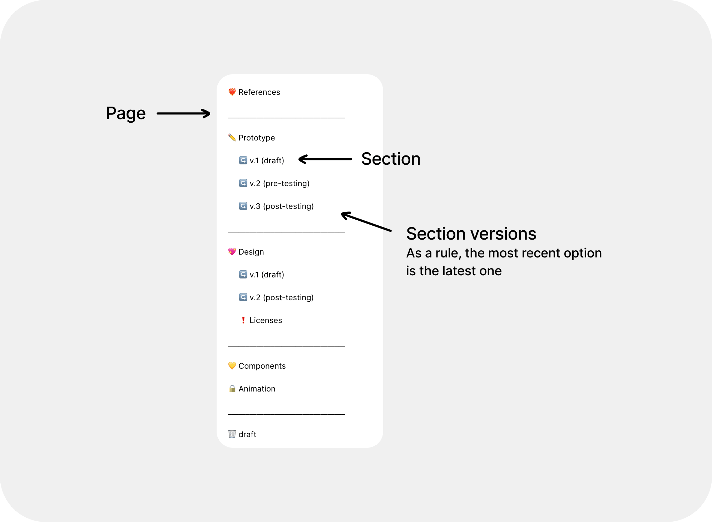
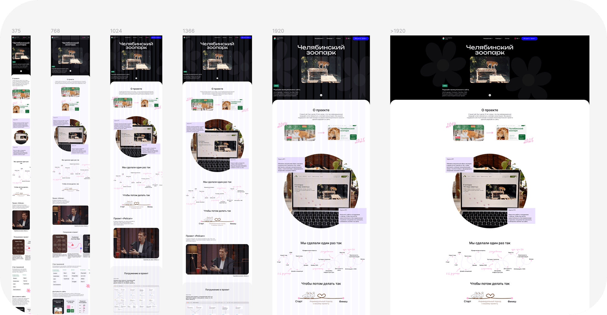
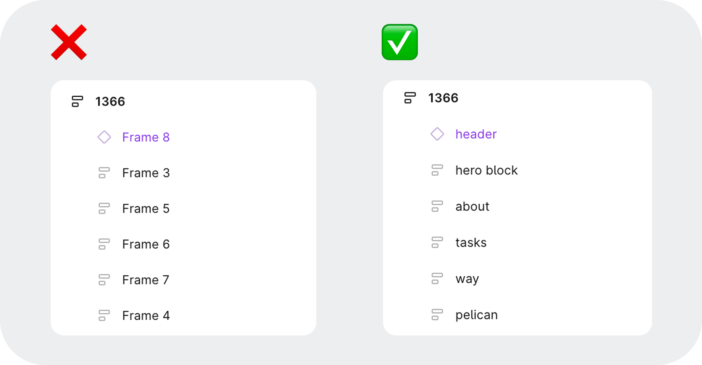
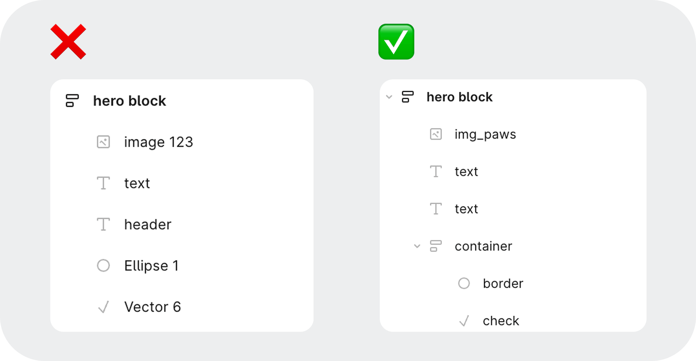
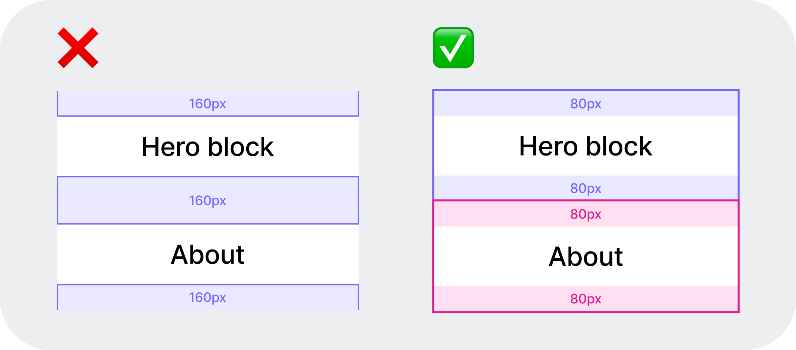
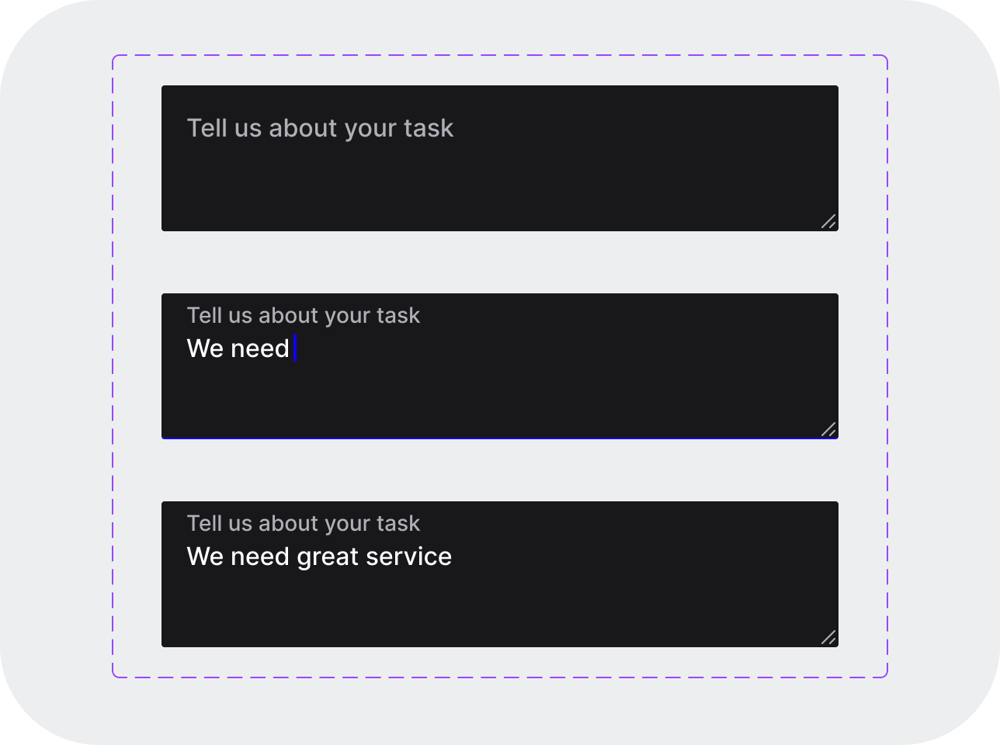
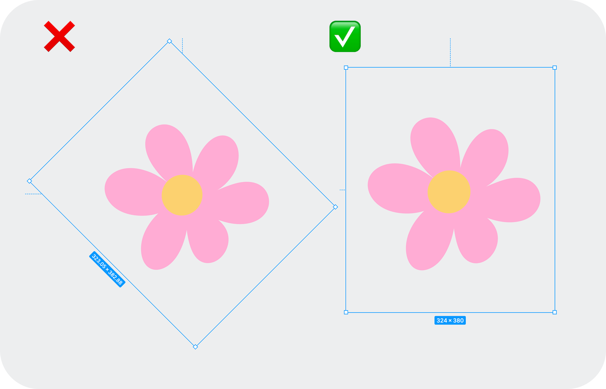
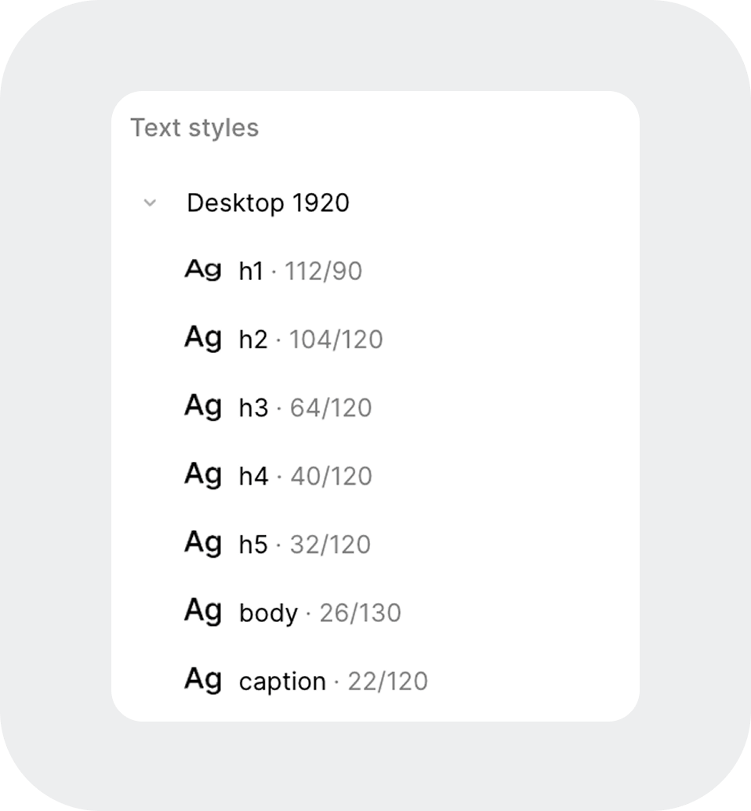
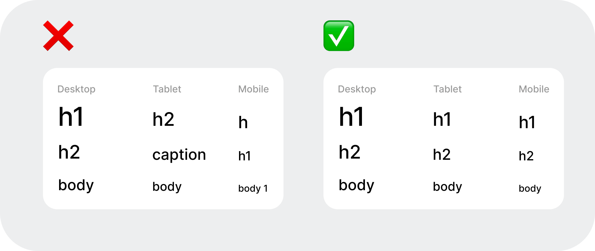

# Preparing Design Layouts for Development #

This document describes the requirements for design layouts before they are handed over for development. The goal is to reduce the number of questions from developers, speed up development, and reduce the number of bugs.

## 1. Figma File Structure ##

The Figma file should be clear to any developer or designer opening it for the first time. 
The recommended page structure is: 

__Recommendations:__
- Screens are grouped by sections
- No chaotic frames
- Archive is placed separately
- Components are stored in a centralized way

## 2. Responsive Design ##

All layouts must be prepared for the main screen sizes: Desktop, Laptop, Tablet, and Mobile, based on popular user devices and the screen widths at which the interface starts to rearrange.

For each breakpoint, set specific font sizes, paddings, and component dimensions, while leaving the names of the text styles the same.

Blocks and components should logically rearrange themselves when the screen size changes. For example, horizontally arranged cards on Desktop should stack vertically on mobile devices, preserving order and meaning (exceptions are possible).

## 3.Layout Structure Logic (Blocks) ##

Divide the design layout into logical blocks and name the blocks according to their meaning.

## 4.Layers ##

Delete or hide redundant layers. The layer’s name should describe its content or function. Identical elements should have the same name across all screens. Abbreviations can be used if they are commonly understood within the team.

## 5.Consistent Spacing System Between Blocks ##

Create spacings between blocks using the internal padding of the blocks, not by the distance between them.

## 6.Consistent System ##

A single spacing system must be used in the interface. All key interface values should be multiples of 4px or 8px and applied consistently. 

The system applies to:
- paddings
- distances between elements (i.e., margins)
- components dimensions 
- border-radius
- grids

__Avoid__ random or broken values (e.g., 13 or 13.32) and adhere to the system throughout the layout.

## 7.Components ##

All repeating elements, whether on the same layout or different ones, should be made as components. If an element has multiple display variations, the components should have states (e.g., default, hover, focus, etc.).

## 8.Interface and Element States ##

Demonstrate the elements’ states directly in the layout or next to the main screen.

## 9. Images in Design ##

Try to use standard image aspect ratios (e.g., 4:3) and maintain proportions across all screen sizes. Place the images from the layouts next to the layout or in a folder on Google Drive. Keep the effects applied to images in the design, but don’t round the corners if it's part of the design. Images with a transparent background should be PNGs and should be compressed [here](https://tinypng.com/), all others should be JPEGs and should be compressed [here](https://www.iloveimg.com/ru/compress-image/compress-jpg).

## 10. Graphic Elements and Illustrations ##

The layout should use the formats intended for the final code. Place them next to the layout, in the UI Kit in vector format, or in a folder on Google Drive in SVG format.

## 11. Typography and its Styles ##

The same font must be used in the design and in development. Make sure to check the font’s license at the early stages and attach a link to it in the UI Kit. Line height should be set as a percentage and provided to developers as a unitless number (e.g., in design line height can be specified as 130%, whereas for developers it should be specified as 1.3).
All information on typography should be compiled into a single system of text styles for different screen sizes, forming a style system in Figma.

Basic Rules:
- Text style names must remain the same for each screen size in the design.
- Different font sizes can be used for different screen sizes; changes should only occur in size, line height, or tracking (i.e., letter spacing).
- Do not create new styles for each screen size with different names.

## 12. Color System ##

The project must use a unified color system.
Define and store all interface colors in the color’s styles in Figma. The same color must be used via the same style. If a new color appears, add it to the system. Group colors by their purpose. Avoid using transparency for block backgrounds when possible, as the final rendered image might differ from the layout due to layer blending in the code.

## 13. Animations and Effects ##

Provide a description or preferably a video or a prototype in Figma for all animations and complex effects.

## 14. Communication with Developers ##

Before handing over the layouts for development, arrange a demo call with the developers to present the design and agree on its feasibility.

