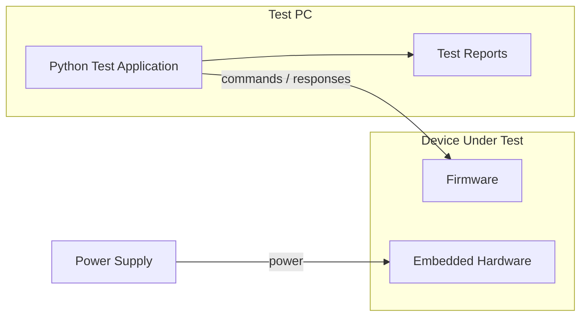
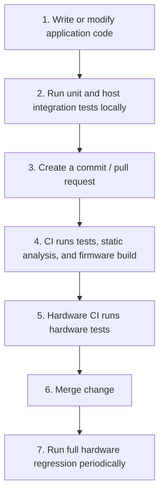

# Embedded Testing Workflow Template: C++, CMake, GoogleTest, and Hardware-in-the-Loop

This article provides a practical example of how to set up testing in an embedded project at various levels: from unit tests to Hardware-in-the-Loop testing.

The example project uses the following tools and techniques:
* **C/C++** language;
* **CMake** as the build system;
* **GoogleTest** for unit and host-based integration tests;
* **interfaces** for hardware abstraction;
* **mocks and fakes** for hardware-independent testing;
* **cross-compiler** for the embedded target;
* **PC application** for functional testing (Python-based);
* **CI pipeline** for automating both host and hardware-dependent tests.

The example is intentionally simplified, but the same structure can be applied to much larger embedded projects.

## Project Structure

A possible project structure is:

```text
embedded-project/
├── CMakeLists.txt
├── cmake/
│   └── toolchains/
│       └── embedded.cmake
│
├── src/
│   ├── application/
│   │   ├── controller.cpp
│   │   └── controller.h
│   │
│   ├── hal/
│   │   ├── i_gpio.h
│   │   ├── i_uart.h
│   │   └── i_timer.h
│   │
│   └── platform/
│       ├── embedded/
│       │   ├── gpio.cpp
│       │   ├── uart.cpp
│       │   └── timer.cpp
│       │
│       └── host/
│           ├── gpio_fake.cpp
│           ├── uart_fake.cpp
│           └── timer_fake.cpp
│
├── firmware/
│   └── main.cpp
│
├── tests/
│   ├── unit/
│   │   ├── test_controller.cpp
│   │
│   └── integration/
│       └── test_controller_hal.cpp
│
├── tools/
│   └── device-test/
│       ├── requirements.txt
│       ├── device.py
│       └── test_device.py
│
└── .github/
    └── workflows/
        └── ci.yml
```
The example focuses on testing organization rather than a particular application architecture. The application layer is intentionally kept simple so that the main focus remains on how the same codebase is tested across host, target, and hardware environments.
The dependency direction is:

```text
Application
     |
     v
Hardware Interfaces
     |
     +------------------+
     |                  |
     v                  v
Embedded             Host
Implementation       Fake/Mock
```

This allows the same application code to be compiled in both environments.

## Hardware Abstraction Interfaces

Let's assume, for example, that we need to control an LED in our project. To do this, we'll use a GPIO output. This simple example will also demonstrate how hardware interfaces can be replaced with fakes during testing.
<details>
<summary>What is GPIO</summary>

**GPIO (General-Purpose Input/Output)** is a basic interface used by a microcontroller to interact with external hardware. A GPIO pin can be used as an output, for example to turn an LED on or off, or as an input, for example to read a button.
</details>

Consider a simple GPIO interface:
```cpp
class IGpio 
{
public:
    virtual ~IGpio() = default;

    virtual void set(bool value) = 0;
    virtual bool get() const = 0;
};
```

The application can depend only on this interface:

```cpp
#include "i_gpio.h"

class Controller
{
public:
    explicit Controller(IGpio& led)
        : led_(led)
    {
    }

    void setActive(bool active)
    {
        led_.set(active);
    }

private:
    IGpio& led_;
};
```

There is no reference to a specific microcontroller, register, SDK, or operating system in this code.

The embedded implementation can interact with the actual GPIO peripheral:

```cpp
class EmbeddedGpio : public IGpio
{
public:
    void set(bool value) override
    {
        // Write to hardware register
    }

    bool get() const override
    {
        // Read from hardware register
        return false;
    }
};
```

The host environment can use a simple fake:

```cpp
class FakeGpio : public IGpio
{
public:
    void set(bool value) override
    {
        value_ = value;
    }

    bool get() const override
    {
        return value_;
    }

private:
    bool value_ = false;
};
```

The application does not need to know which implementation it is using.

## Unit Testing with GoogleTest

This design makes unit testing straightforward.

A test can instantiate the application with the fake GPIO:

```cpp
#include <gtest/gtest.h>

TEST(ControllerTest, ActivatesLed)
{
    FakeGpio gpio;
    Controller controller(gpio);

    controller.setActive(true);

    EXPECT_TRUE(gpio.get());
}

TEST(ControllerTest, DeactivatesLed)
{
    FakeGpio gpio;
    Controller controller(gpio);

    controller.setActive(false);

    EXPECT_FALSE(gpio.get());
}
```

These tests do not require:

* an embedded board;
* a debugger;
* a cross-compiler;
* a physical GPIO;
* a specific processor;
* any external equipment.

They can run on an ordinary developer workstation or a standard CI runner.

This is one of the main benefits of hardware abstraction: most of the application behavior can be verified without hardware.

Running unit tests locally also provides a much faster development feedback loop. Developers can make a change, run the tests, see the result immediately, and continue iterating without having to build, flash, or interact with the physical device.

This also makes the architecture well suited for a Test-Driven Development (TDD) workflow, where tests can be written and executed before the corresponding implementation is completed.

## Host Integration Tests

Unit tests verify individual components, but it is also useful to test several layers together.

For example:

```text
Controller
    |
    v
Protocol Layer
    |
    v
Fake UART
```

A fake UART can record transmitted data and provide predefined responses.

```cpp
class FakeUart : public IUart
{
public:
    void write(const uint8_t* data, size_t size) override
    {
        transmitted_.insert(
            transmitted_.end(),
            data,
            data + size
        );
    }

    void setResponse(const std::vector<uint8_t>& response)
    {
        response_ = response;
    }

    const std::vector<uint8_t>& transmitted() const
    {
        return transmitted_;
    }

private:
    std::vector<uint8_t> transmitted_;
    std::vector<uint8_t> response_;
};
```

An integration test can then verify the complete interaction between the application and the communication layer.

This type of test is still fast because no physical device is involved.

## CMake Configuration

CMake can be used to build both the host-based tests and the embedded firmware from the same source tree.

The key idea is to keep the application code independent from the platform implementation and let the build configuration select which implementation is used.

For example, the project can define three libraries: application, host platform, embedded platform. 

The **application library** contains the platform-independent application code:

```cmake
add_library(application
    src/application/controller.cpp
)

target_include_directories(application
    PUBLIC
        src/application
        src/hal
)
```

The **host platform** provides fake implementations that can be used by unit and host integration tests:

```cmake
add_library(host_platform
    src/platform/host/gpio_fake.cpp
    src/platform/host/uart_fake.cpp
    src/platform/host/timer_fake.cpp
)

target_link_libraries(host_platform
    PUBLIC
        application
)
```

The **embedded platform** provides the implementations that interact with the actual hardware:

```cmake
add_library(embedded_platform
    src/platform/embedded/gpio.cpp
    src/platform/embedded/uart.cpp
    src/platform/embedded/timer.cpp
)

target_link_libraries(embedded_platform
    PUBLIC
        application
)
```

The host test executable can then use the host platform:

```cmake
find_package(GTest REQUIRED)

add_executable(unit_tests
    tests/unit/test_controller.cpp
)

target_link_libraries(unit_tests
    PRIVATE
        application
        host_platform
        GTest::gtest_main
)
```

The embedded firmware uses the embedded platform instead:

```cmake
add_executable(firmware
    firmware/main.cpp
)

target_link_libraries(firmware
    PRIVATE
        application
        embedded_platform
)
```

This means that the application code remains the same, while the platform implementation changes depending on the target.

The embedded target can use a separate CMake toolchain file - embedded.cmake from exaple project structure. For example, an ARM-based target might use:

```cmake
set(CMAKE_SYSTEM_NAME Generic)

set(CMAKE_C_COMPILER arm-none-eabi-gcc)
set(CMAKE_CXX_COMPILER arm-none-eabi-g++)

set(CMAKE_TRY_COMPILE_TARGET_TYPE STATIC_LIBRARY)
```

The exact compiler and configuration depend on the target architecture. The same concept applies to other embedded architectures and toolchains.

The host and target builds can therefore be configured independently:

```bash
# Host build
cmake -B build/host
cmake --build build/host

# Embedded build
cmake -B build/target \
    -DCMAKE_TOOLCHAIN_FILE=cmake/toolchains/embedded.cmake

cmake --build build/target
```

The important point is that CMake does not change the application code itself. Instead, it builds the same application with different platform implementations. The host build links the application with fakes, while the embedded build links it with the real hardware implementation.

## Building the Firmware

After host tests pass, the firmware can be built using the target toolchain.

A typical CI workflow might execute:

```bash
cmake -B build/target \
    -DCMAKE_TOOLCHAIN_FILE=cmake/toolchains/embedded.cmake

cmake --build build/target --parallel
```

The resulting artifacts might include:

```text
build/target/
├── firmware.elf
├── firmware.hex
└── firmware.bin
```

The `.elf` file typically contains debugging symbols and is useful for debugging, while `.hex` or `.bin` files are commonly used for programming the device.

The firmware build should be treated as a separate CI artifact from the host test executable.

## PC-Based Functional Test Application

The next layer of testing verifies the firmware running on the real device.

At this stage, the test system needs some software running on a PC that can communicate with the device and verify its behavior. This can be implemented as a dedicated custom application, for example a desktop application with a graphical user interface, or as a command-line test tool.
A custom application can provide a convenient interface for test operators but building such an application require significant development effort.

For a quick start, a Python script combined with a testing framework such as pytest is often sufficient. Python provides libraries for serial communication, USB, networking, and test automation, while pytest makes it easy to organize tests and generate test reports.

A simplified device API could look like:

```python
class Device:
    def __init__(self, port):
        self.port = serial.Serial(port, 115200, timeout=2)

    def reset(self):
        self.send("RESET")

    def set_mode(self, mode):
        return self.send(f"SET_MODE {mode}")

    def get_status(self):
        return self.send("GET_STATUS")

    def send(self, command):
        self.port.write((command + "\n").encode())
        return self.port.readline().decode().strip()
```

A functional test can then be written in a readable form:

```python
def test_device_activation(device):
    device.reset()

    assert device.set_mode("ACTIVE") == "OK"

    status = device.get_status()

    assert status == "ACTIVE"
```

The test is intentionally independent from the implementation of the firmware.

It verifies the device through its external interface, just as a real user or another system would interact with it.

### Functional Test Execution

The test application can be executed from the command line:

```bash
pytest tools/device-test \
    --port /dev/ttyUSB0
```

A successful execution could produce:

```text
================ test session starts ================

test_device.py::test_device_connection       PASSED
test_device.py::test_device_reset            PASSED
test_device.py::test_device_activation       PASSED
test_device.py::test_device_status           PASSED
test_device.py::test_invalid_command         PASSED

================ 5 passed in 8.42s ==================
```

This makes the hardware test suite behave like a conventional automated test suite.

The difference is that the test runner is communicating with a physical device instead of executing all code locally.

## Hardware-in-the-Loop

When the PC test application communicates with a real embedded device, this can be part of a **Hardware-in-the-Loop (HIL)** or automated hardware testing setup.

Unlike unit and host-based integration tests, HIL tests execute against the actual firmware running on physical hardware. The PC test application sends commands to the device, reads its responses, and verifies its externally observable behavior.

In this example, we use a simplified hardware-based testing setup where the PC communicates directly with the real device through its external interface:



The PC acts as the test controller. It is responsible for starting the tests, communicating with the device, checking the results, and generating test reports. The device under test runs the real firmware, so these tests can verify behavior that cannot be fully reproduced in a host environment.

The physical setup can be very simple. For example, a development board connected to a PC through USB may be enough for basic functional tests. As the project grows, the same approach can be extended to a dedicated hardware test bench with programmable power supplies, communication interfaces, multiple devices, and additional test equipment.

The key idea is that the test logic remains on the PC, while the behavior being tested is executed on the real embedded hardware.

## CI Pipeline

The entire workflow can then be automated.

A simplified GitHub Actions workflow might look like:

```yaml
name: Embedded CI

on:
  push:
  pull_request:

jobs:

  host-tests:
    runs-on: ubuntu-latest

    steps:
      - uses: actions/checkout@v4

      - name: Configure
        run: cmake -B build/host

      - name: Build
        run: cmake --build build/host

      - name: Run tests
        run: ctest --test-dir build/host --output-on-failure


  firmware:
    runs-on: ubuntu-latest

    steps:
      - uses: actions/checkout@v4

      - name: Configure
        run: >
          cmake
          -B build/target
          -DCMAKE_TOOLCHAIN_FILE=cmake/toolchains/embedded.cmake

      - name: Build firmware
        run: cmake --build build/target

      - name: Upload firmware
        uses: actions/upload-artifact@v4
        with:
          name: firmware
          path: build/target/firmware.bin
```

This pipeline can run on every pull request because neither job requires physical hardware.

The hardware-dependent job is different. It needs a **self-hosted runner** connected to the test device:

```yaml
  hardware-tests:
    runs-on: [self-hosted, embedded-hardware]
    needs: firmware

    steps:
      - uses: actions/checkout@v4

      - name: Download firmware
        uses: actions/download-artifact@v4
        with:
          name: firmware

      - name: Flash device
        run: ./tools/flash_device.sh firmware.bin

      - name: Run hardware tests
        run: |
          pytest tools/device-test \
            --port /dev/ttyUSB0 \
            --junitxml=hardware-results.xml

      - name: Upload test results
        uses: actions/upload-artifact@v4
        with:
          name: hardware-test-results
          path: hardware-results.xml
```

The exact implementation will depend on the CI system, flashing tool, debugger, communication interface, and hardware test bench.

## Recommended Development Workflow

A practical workflow for developers can be:



The main principle of this workflow is to test the same application at different levels, using the fastest and cheapest environment that provides sufficient confidence. Hardware-dependent code should be isolated behind well-defined interfaces so that most application behavior can be tested without physical hardware.

This allows the project to combine fast local development and CI feedback with realistic validation on the actual device.
