# Accessibility Testing

## Context

Accessibility testing ensures our web pages meet established accessibility criteria (WCAG). We use a combination of automated tools and manually written E2E tests to verify that all users, including those using assistive technologies, can effectively interact with our products.

## What to Test
Test all aspects of user interaction, including:
1. Attributes: role, tabindex, aria-attributes.
2. Interaction: click events, keyboard navigation (Tab, Enter, Space).
3. Visual Presentation: readability, color contrast, element positioning, and zoom behavior.

## E2E Accessibility Testing Strategy

### Types of tests

1. **ariaAttrsTest.spec.tsx**

This test automates a person pressing Tab through the entire page and verifies that focus is placed on the right elements in the right order. It ensures keyboard-only users (e.g., those with motor disabilities or using screen readers) can navigate the site predictably, without getting stuck or encountering illogical focus jumps.

2. **axeCheckUpPage.spec.tsx**

This test runs an automated axe-core scan on a page across all device sizes and reports any WCAG violations found, including but not limited to:
- color contrast ratios
- missing or invalid ARIA attributes
- missing alt text on images
- proper heading hierarchy
- form label associations
- landmark roles

3. **focusIndicatorTest.spec.tsx**

This test ensures every link and button on the page shows a visible "I am focused" style when tabbed to. It matters because users navigating with a keyboard must be able to see which element currently has focus. Without a visible indicator (e.g., a blue outline), they cannot navigate effectively. This is a core WCAG 2.1 success criterion.

4. **focusOrderTest.spec.tsx**

This test verifies that when a user navigates using only the Tab key, interactive elements receive focus in a logical, predictable order that matches the visual layout of the page. It matters because if focus jumps randomly or skips critical elements, the site becomes hard to use for keyboard-only users.

## Анализаторы доступности:

- [Eslint-plugin-jsx-a11y](https://www.npmjs.com/package/eslint-plugin-jsx-a11y) - линтер доступности JSX элементов
- [Stylelint-a11y](https://www.npmjs.com/package/stylelint-a11y) - линтер CSS
- [AccessLint](https://accesslint.com/) - апп для гитхаба, который находит проблемы с доступностью в пулреквестах в HTML
- [axe-core](https://www.npmjs.com/package/cypress-axe) - библиотека, интегрируемая в cypress 

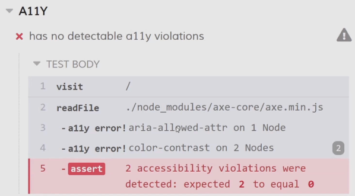

*Пример работы axe в cypress*

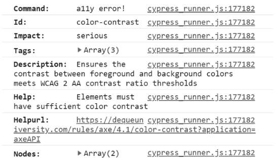

*Подробная информация в консоли*

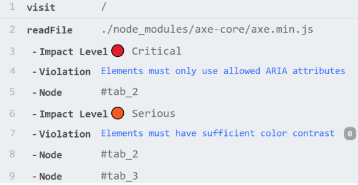

*[Улучшенные логи axe](https://github.com/denis-biruk/a11y-test-tabs/blob/master/cypress/support/commands/checkPageA11y.js)*

В cypress из коробки по прежнему нет поддержки браузерных событий (например tab click). Но есть плагин [Cypress-real-events](https://github.com/dmtrKovalenko/cypress-real-events) (MIT), который позволяет проверять браузерные события.
Ссылка на [stackoverflow](https://stackoverflow.com/questions/55009332/cypress-type-tab-key).

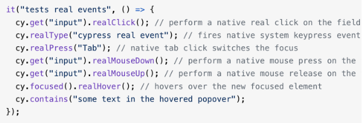

Playwright позволяет тестировать браузерные события, для него также есть плагин axe-core.

### Плюсы Playwright

- Тестирование нативных браузерных событий
- Есть плагин axe-core

### Минусы Playwright
- Интерфейс менее наглядный, чем в Cypress
- Для нас выше порог входа
- Синтаксис более многословный (async, переходы по url)

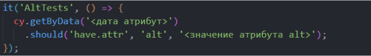 
*Пример проверки alt на Cypress* 

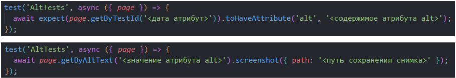 
*Примеры проверки alt на Playwright* 

 
*Пример проверки alt на Cypress* 

 
*Примеры проверки alt на Playwright* 

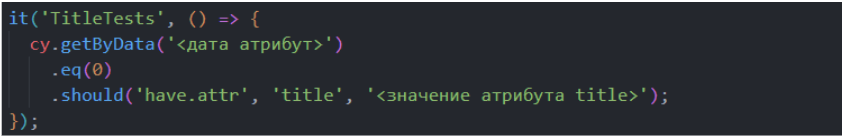 
*Пример проверки title на Cypress* 

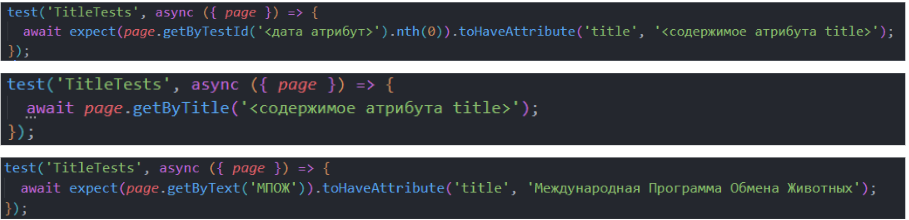 
*Примеры проверки title на Playwright* 

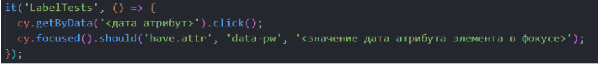 
*Пример проверки label на Cypress* 

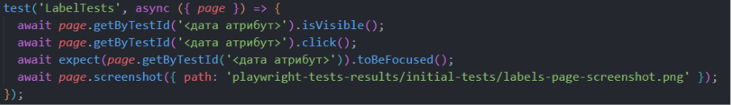 
*Примеры проверки label на Playwright* 

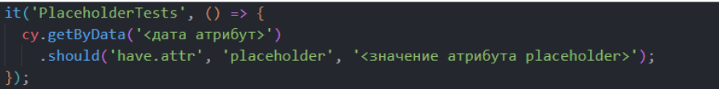 
*Пример проверки placeholder на Cypress* 

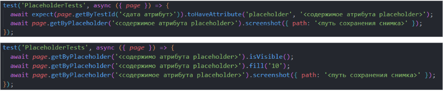 
*Примеры проверки placeholder на Playwright* 

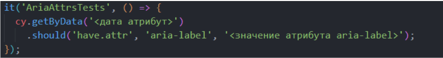 
*Пример проверки aria на Cypress* 

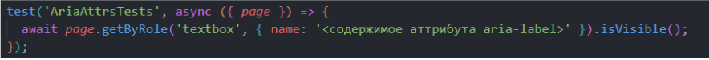 
*Примеры проверки aria на Playwright* 

Выборка производится по aria ролям, определённых в спецификации W3C (пункт 5.2.8.4) - https://www.w3.org/TR/wai-aria-1.2/#roles

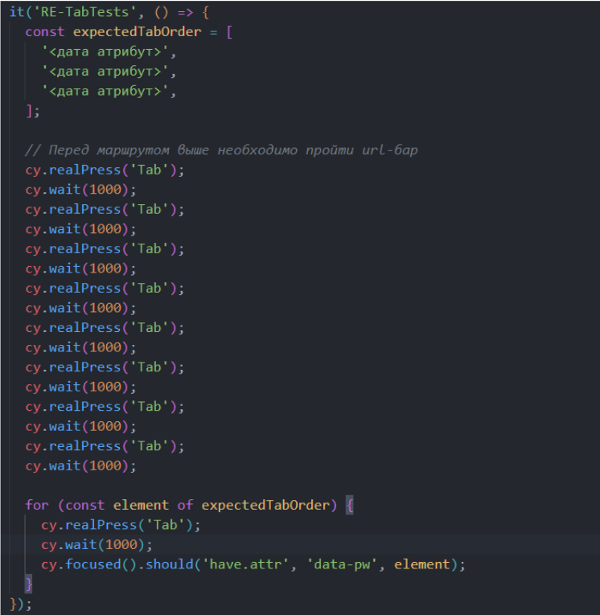 
*Пример проверки tab на Cypress* 

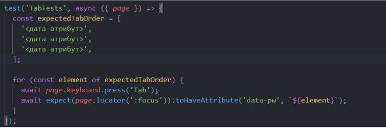 
*Примеры проверки tab на Playwright* 

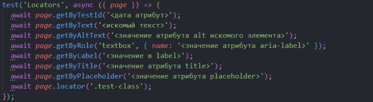  
*Пример обращения к элементам различными способами на Playwright* 

Страница [Locators API](https://playwright.dev/docs/locators) в документации Playwright.

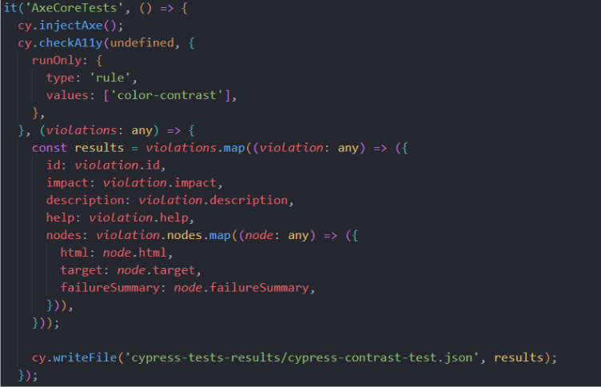  
*Пример проверки контрастности на Cypress с использованием пакета axe-core*  

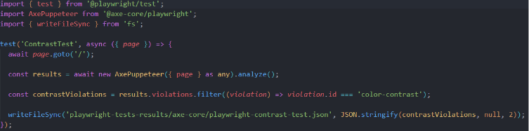  
*Пример проверки контрастности на Playwright с использованием пакета axe-core*  

## When to Write What Test

| Development Stage | Test Type |
| :--- | :--- |
| Component is styled, has interactive elements | Manual Playwright tests (tab, focus, aria-label) |
| Page is fully styled and integrated | `axe-core` automated scan via Playwright |
| During code review | a11y plugins |
| Post-deploy | Manual review (screen reader, zoom, tab order) |

##  What Cannot Be Fully Automated
Automated tools don't catch 100% accessibility issues. The following must be tested manually:
| Category | Examples |
| :--- | :--- |
| **Color Perception** | Is color the only differentiator for status? |
| **Label Redundancy** | Repetitive or uninformative link text (e.g., multiple "Click Here" links). |
| **Visual Order (Tab order)** | Does the keyboard focus order match the visual layout? |
| **UI Overlay / Zoom** | Does the interface break or overlap at 200% zoom? |
| **Semantic Correctness** | Using `<table>` for layout instead of data, or `
` for a button. |
| **Focus Traps** | Can the user Tab out of a modal or date picker? |
| **Content Quality** | Form validation messages, translation accuracy, meaningful alt text for images. |
| **Usability** | Overall ease of use with screen readers. |

### Examples
#### Color Perception
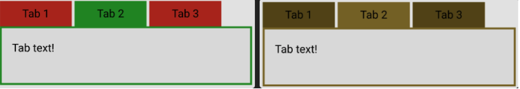
#### Label Redundancy
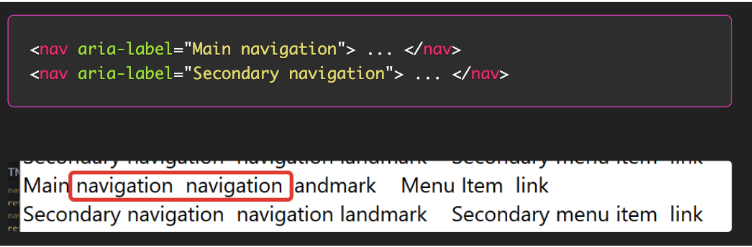
#### Visual Order
#### UI Overlay 
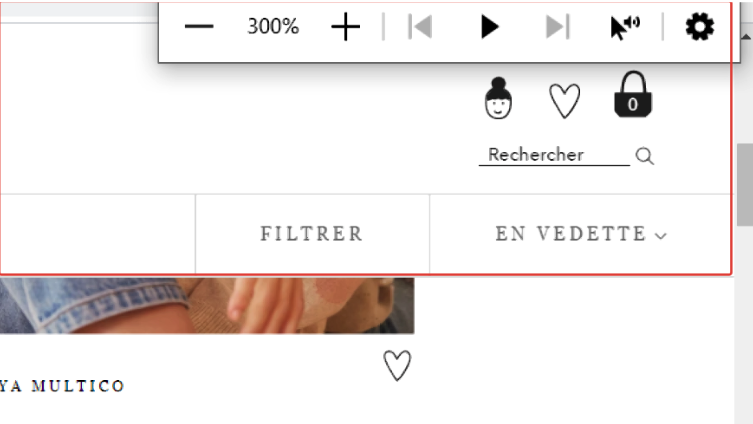 
#### Wrong Semantics
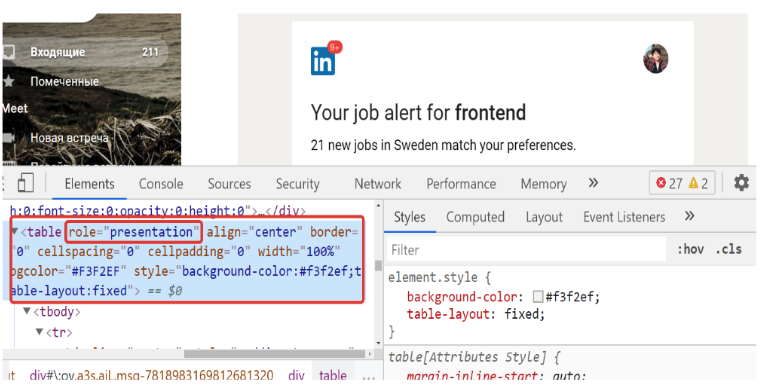  
*Убираем семантику*

#### Focus Traps
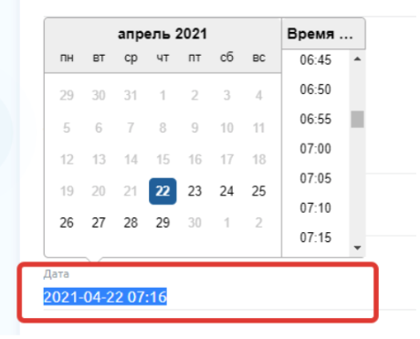
#### Content Quality
#### Form Validation
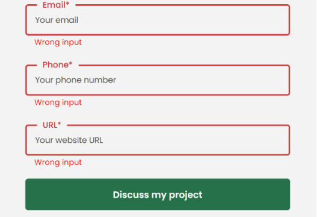
#### Wrong Translation
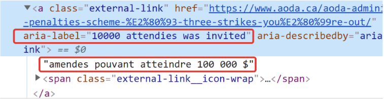

#### Inadequate alt
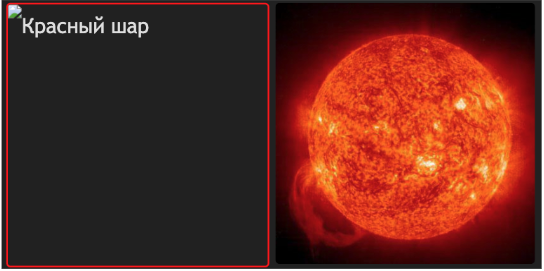

[Доклад: Как протестировать accessibility руками](https://www.youtube.com/watch?v=-N34pdUcJf0&list=PLNSmyatBJig6ciyZ8A8zU0ZCngZxj858X&index=14)
[Доклад: npm run a11y-test](https://holyjs.ru/archive/2021%20Piter/talks/6zmpjnochngcpe7qksvglj/?referer=/archive/2021%20Piter/talks/)

### Инструменты 
- Автоматический отчет о доступности
- [W3C Валидатор](https://validator.w3.org/)
- Google Lighthouse
- [WAVE](https://wave.webaim.org/) Web Accessibility Evaluation Tool 
- [axeDevTools](https://chromewebstore.google.com/detail/axe-devtools-web-accessib/lhdoppojpmngadmnindnejefpokejbdd?utm_source=deque.com&utm_medium=referral&utm_campaign=axe_chrome_logo)

- Скринридеры (NVDA для Windows, VoiceOver для Mac)
